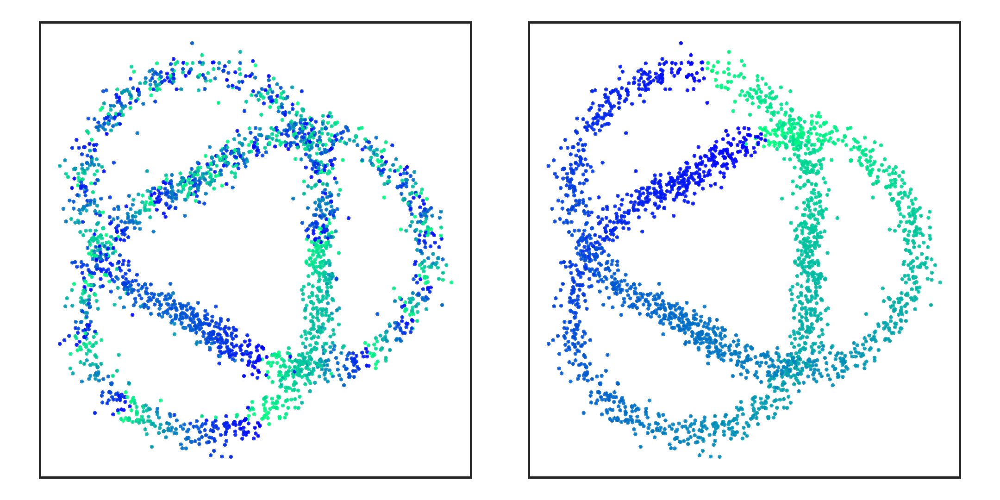

# Lifting Cocycles: From Heuristic to Theory

The circular coordinates algorithm extracts circle-valued features from data by
lifting persistent cocycles from a finite field to the integers. This repository
accompanies our study of when the commonly used coefficientwise lift succeeds,
how finite-field rescaling can make it succeed, and how an integral cocycle can
be reduced to winding number 1. We also extend the lifting principles to
homology cycles.

## Scaling before lifting

